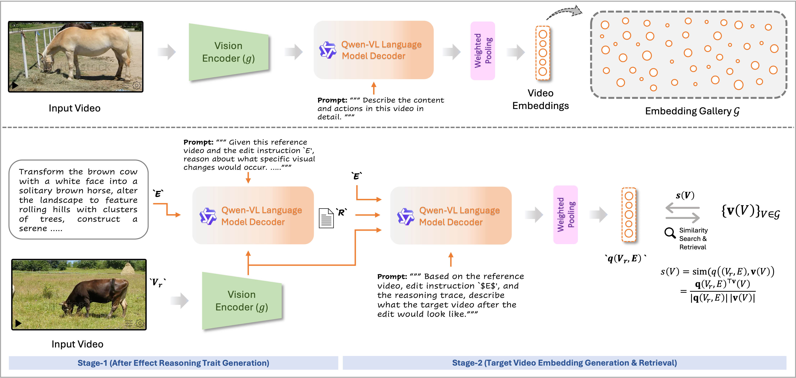

<div align="center">
  <!--  -->
  <h1 align="center">CoVR-R: Reason-Aware Composed Video Retrieval</h1>
</div>


<div  align="center" style="margin-top:10px;"> 

  
[Omkar Thawakar](https://omkarthawakar.github.io)\*, [Dmitry Demidov](https://scholar.google.com/citations?user=k3euI0sAAAAJ&hl=en)\*, [Vaishnav Potlapalli](https://scholar.google.com/citations?user=UOB0uKgAAAAJ&hl=en)\*,[Sai Prasanna Teja Reddy Bogireddy](https://scholar.google.com/citations?user=Yg5L4UkAAAAJ&hl=en)\*,[Viswanatha Reddy Gajjala](https://scholar.google.com/citations?user=9C5TEbkAAAAJ&hl=en)\*,[Alaa Mostafa Lasheen](), [Rao Muhammad Anwer](https://scholar.google.com/citations?user=_KlvMVoAAAAJ&hl=en), [Fahad Khan](https://scholar.google.com/citations?user=zvaeYnUAAAAJ&hl=en)

**Mohamed bin Zayed University of Artificial Intelligence, University of Chicago, IBM Research, Amazon, Linköping University**

<em> <sup> *Equal Contribution  </sup> </em>
<br>

</div>

## 🔎 Overview

**Composed Video Retrieval (CoVR)** retrieves a target video given:

- a **reference video** `V_r`
- a **textual modification (edit)** `E`

Most prior work treats the edit as literal keyword constraints. However, real-world edits imply **after-effects** — causal, temporal, and cinematographic consequences that are not explicitly stated.

Examples:

- “Change typing to frustration” → implies *clenched fists* and *closing the laptop*
- “Make it a close-up” → implies *tighter framing* and *shorter duration*
- “Turn raw ingredients into cooked” → implies *state transitions (raw → browned)*

We show that **successful CoVR requires reasoning about these implied consequences**.

---

## 🧠 Why Reasoning is Necessary

Standard retrieval systems often rely on word overlap.  
But many edits require inferring *what must visually happen*, not just matching text.

<p align="center">
  
</p>

**Figure 1.** Examples where success depends on after-effects (state changes, phase order, shot scale) rather than keyword matching.

These cases require reasoning about:

- Object state transitions  
- Temporal phase progression  
- Cinematographic changes (shot scale, camera motion)  

---

## 🚀 Contributions

### 1️⃣ CoVR-R Benchmark

We introduce **CoVR-R**, a reasoning-aware composed video retrieval benchmark:

- **2,800 curated triplets**
- Hard distractors designed to defeat keyword matching
- Structured reasoning annotations per triplet:

R = { states, actions, scene, camera, tempo }

Each triplet contains:

- Reference video  
- Edit text  
- Target video  
- Canonicalized reasoning trace  

<p align="center">
  
</p>

**Figure 2.** Sample triplets from CoVR-R with structured reasoning traces.

CoVR-R focuses on:

- Temporal dependency  
- State transitions  
- Cinematographic consequences  
- Implicit cause-effect reasoning  

---

### 2️⃣ Reason–Then–Retrieve Framework

We propose a **two-stage zero-shot architecture** powered by a frozen **Qwen3-VL** multimodal model.

<p align="center">
  
</p>

**Figure 3.** Overview of the Reason–Then–Retrieve architecture.

---

### 🏗 Stage 1 — After-Effect Reasoning

Given `(V_r, E)`, we prompt Qwen3-VL to generate a structured reasoning trace:

- Object states  
- Action phases  
- Scene changes  
- Camera/framing  
- Tempo/pacing  

This produces:
R = { states, actions, scene, camera, tempo }
---

### 🧾 Stage 2 — Target Description & Retrieval

1. Generate a hypothetical post-edit description  
2. Extract token embeddings from Qwen3-VL  
3. Apply **importance-weighted pooling**  
4. Compute cosine similarity with gallery embeddings  

✔ No task-specific fine-tuning  
✔ Fully zero-shot  
✔ Caption-free  

---

## Quick Start

### Install

```
pip install -r requirements.txt
```
### CoVR-R (Reasoning Based Retrieval)

```bash
python generate_embeddings.py --config configs/reasoning_webvid8m.yaml
python evaluate.py --config configs/reasoning_webvid8m.yaml
python evaluate.py --config configs/reasoning_webvid8m.yaml --reasoning_strategy self_consistency
python evaluate.py --config configs/reasoning_webvid8m.yaml --reasoning_strategy single_stage
```

### WebVid8M

```bash
python generate_embeddings.py --config configs/webvid8m.yaml
python evaluate.py --config configs/webvid8m.yaml
```

### Dense WebVid8M

```bash
python generate_embeddings.py --config configs/dense_webvid8m.yaml
python evaluate.py --config configs/dense_webvid8m.yaml
```


## 📊 Results

We evaluate on:

- **CoVR-R (ours)** — reasoning-heavy benchmark  
- **Dense-WebVid-CoVR** — large-scale benchmark  

---

### 📌 CoVR-R Results

| Model | R@1 | R@5 | R@10 | R@50 | Reasoning Score |
|-------|------|------|------|------|----------------|
| Best BLIP baseline | 37.90 | 57.67 | 64.48 | 79.47 | 6.42 |
| Ours (no explicit reasoning) | 44.32 | 61.91 | 67.33 | 79.90 | – |
| **Ours + Reasoning** | **49.88** | **66.99** | **72.97** | **85.14** | **8.31** |

- +16% relative improvement over prior methods  
- Strong gains on implicit-effect subsets  
- Significant reasoning quality improvements  

---

### 📌 Dense-WebVid-CoVR Results

| Model | R@1 | R@5 | R@10 | R@50 |
|-------|------|------|------|------|
| BSE-CoVR | 48.08 | 73.36 | 81.06 | 93.78 |
| **Ours** | **58.19** | **80.50** | **86.92** | **97.14** |
| **Ours + R** | **61.21** | **83.40** | **89.39** | **97.61** |

- +13.13 absolute R@1 improvement over strongest baseline  
- Zero-shot  
- Caption-free  
- No task-specific fine-tuning  

---

## 🧪 Key Ablations

### 🔹 Model Scaling (CoVR-R)

| Backbone | R@1 | Reasoning Score |
|-----------|------|----------------|
| Qwen3-VL-4B | 43.98 | 7.95 |
| Qwen3-VL-8B | 49.88 | 8.31 |
| Qwen3-VL-72B | 55.48 | 9.05 |

Performance scales with reasoning capability.

---

### 🔹 Pooling Strategy

| Pooling | R@1 |
|----------|------|
| Mean | 44.87 |
| Max | 35.95 |
| Last token | 1.51 |
| **Importance-weighted (ours)** | **49.88** |

Importance-weighted pooling significantly outperforms standard aggregation.

---

## 🎯 Why This Matters

CoVR-R shifts CoVR from:

> Triplet matching  

to

> **Consequence modeling**

It demonstrates that:

- Keyword matching is insufficient  
- Temporal reasoning is critical  
- Cinematographic reasoning matters  
- State transitions must be modeled  
- General-purpose LMM reasoning can drive retrieval  

---

## 📜 Citation

```bibtex
@inproceedings{thawakar2026covrr,
  title     = {CoVR-R: Reason-Aware Composed Video Retrieval},
  author    = {Thawakar, Omkar and
               Demidov, Dmitry and
               Potlapalli, Vaishnav and
               Bogireddy, Sai Prasanna Teja Reddy and
               Gajjala, Viswanatha Reddy and
               Lasheen, Alaa Mostafa and
               Anwer, Rao Muhammad and
               Khan, Fahad Shahbaz},
  booktitle = {Proceedings of the IEEE/CVF Conference on Computer Vision and Pattern Recognition (CVPR) Findings},
  year      = {2026}
}
